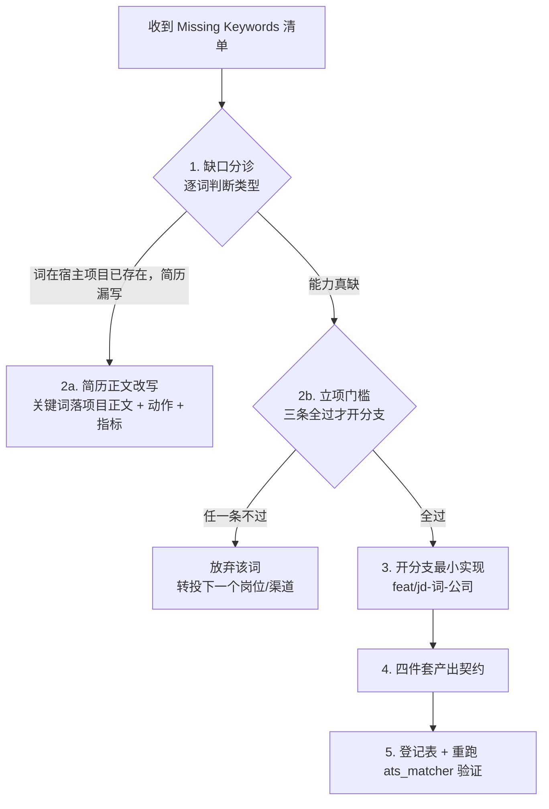

# JD 缺口分诊与分支补强 (Career JD-Gap Branch)

上游：`career-apply-orchestrator` 的 `bounce_facts`，或 `career-multi-agent-eval` /
`bin/ats_matcher.py` 的 missing 清单。本 Skill 负责把「缺词」变成「真能力 + 真证据 + 真简历行」。
编排器优化轮只应看到 bounce_facts，不应看到会审原文。

## 核心原则：简历缺词的正解不是编词，是把词做进真项目

审计机制（`data/cv/audit-cv-*.md` 证据链）负责**检查真实性**；
本流程负责**生产真实性**——让每条简历宣称都有 commit、指标、可现场演示的分支背书。

## 标准工作流



### 第 1 步：缺口分诊（必做，防止无脑开分支）

对每个 missing 关键词，先搜宿主项目代码/文档确认能力是否已存在：

- **词存在、简历漏写** → 走第 2a 步，**禁止开分支**（典型：RAG 在 NovelMind
  已有，ops 版简历正文却没写——改简历 10 分钟的事）
- **能力真缺** → 走第 2b 步立项判断

### 第 2a 步：简历正文改写

改写公式：`关键词 + 研发动作 + 量化结果`，必须落在**项目经历正文**（引擎
D2 计 ×1.0），禁止只写技能栏（×0.25 折扣 + 吹水警示）。改完重跑
`bin/ats_matcher.py` 验证该词从 missing → grounded。

### 第 2b 步：立项门槛（三条全过才开分支）

1. **JD 权重**：该词是目标 JD 核心硬要求（Top5 技术词 / 出现在职责首条），
   非锦上添花；
2. **时间盒 ≤ 1 天**：预估超出即放弃，转投下一家——词不值这个价；
3. **自然宿主**：NovelMind（AI/RAG/向量检索）、local-llm-lab（LLM infra/
   Ollama/路由）、career-os（Python 工程化/数据管道）三者之一装得下，
   不造新仓库。

### 第 3 步：开分支

```bash
cd <宿主项目>
git checkout -b feat/jd-<关键词小写>-<公司缩写>   # 如 feat/jd-langchain-ninebot
```

**红线：分支永不合并主线（用户明确定义），但保留不删**——面试时现场
`git checkout` 演示比简历一行字硬得多。

### 第 4 步：产出契约（四件套缺一不可）

| # | 产物 | 对应引擎得分 | 验收标准 |
|---|---|---|---|
| ① | 可运行最小实现 | — | 能 demo，不是空壳/注释代码 |
| ② | 量化指标 ≥1 个 | D4（15 分） | 时延/条数/通过率等真实测量值 |
| ③ | commit 链 + README 使用片段 | — | 面试反查可溯源 |
| ④ | 简历项目正文改写稿 | D2（30 分） | 关键词落正文，含动作+指标 |
| ⑤ | 流程/Why/坑记录 | — | 写清：为什么开这条分支、怎么测、踩了什么坑、为何不合并。交给用户看，并登记到 `knowledge/jd-gap-*.md` |

开分支写测试时**必须同时写⑤**，禁止只丢代码和 pytest 绿。

### 第 5 步：登记与闭环

登记到 `knowledge/jd-gap-branches.md`（字段见登记表头部说明），然后
重跑 `bin/ats_matcher.py` 确认分数提升，回到会审流程复审。

## 与其他模块的接线

- **上游**：`career-multi-agent-eval` 诊断书的【ATS 致命缺失关键词】→ 本 Skill
- **平行**：`resume-assistant`（简历改写）负责第 2a 步的执行
- **下游**：改写稿经 `data/cv/audit-cv-*.md` 证据链审计后进正式简历
- **数据源**：JD 全文取自 `data/career_jobs.sqlite`（jobs 表或
  platform_recruitment_leads 表）

## 反模式（触发即停）

- ❌ 为凑关键词给不相关项目硬塞功能（面试拷打必穿帮）
- ❌ 只写 README 不写代码的「PPT 分支」
- ❌ 缺词就开分支，不分诊、不设时间盒（海投式勤奋）
- ❌ 分支合并进主线（污染项目主线叙事）
