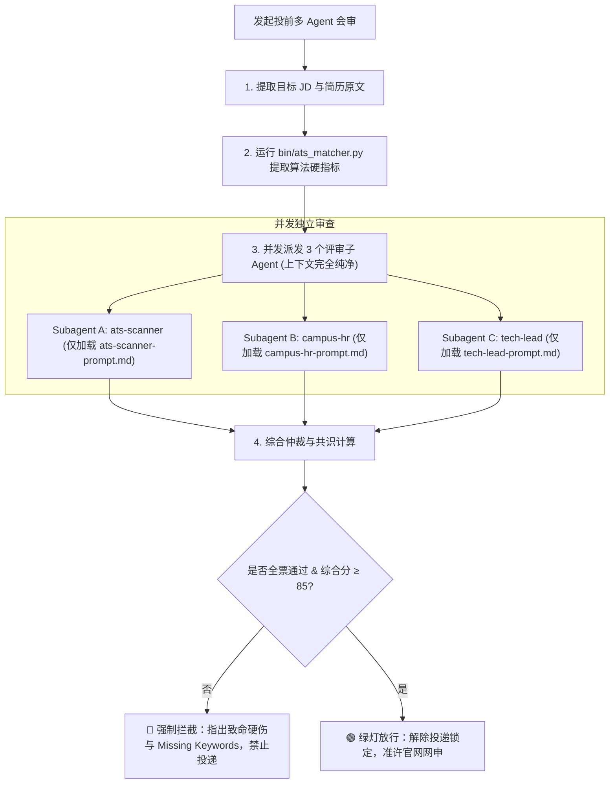

# 投前三方多 Agent 联合会审 (Career Multi-Agent Evaluation)

把每一次正式投递当成一次“防空演练”。坚决杜绝“拿一份大杂烩简历硬塞多个岗位”的虚假勤奋海投。

## 核心设计理念：三权分立，一票否决

真实招聘流程绝不是单一角色做决策，而是三个利益立场相互对立的关卡：

1. **🤖 关卡一：ATS 算法审查员 (`ats-scanner`)** —— 只认冷酷的规则、分词匹配率与硬门槛（Rule 316 复合意向一票否决）；
2. **👩‍💼 关卡二：校招初筛 HR (`campus-hr`)** —— 每天扫 500 份简历、耐心只有 5 秒，极度厌恶“海投标签”与“意向不专一”；
3. **👨‍💻 关卡三：资深技术负责人 (`tech-lead`)** —— 警惕“只会调包的假项目”，逐句拷打 STAR 逻辑、真实踩坑细节与工程量化指标。

---

## 启动时必须读取

- **待审简历**：目标 PDF 文件路径，或 `data/cv/` 下的 Markdown 源码
- **目标 JD**：企业官方网申 JD 全称、职责与任职要求文本（或 `data/career_jobs.sqlite` 中的 `job_id`）
- **底层算法工具**：[`bin/ats_matcher.py`](file:///d:/ADLINK/Myproject/career-os/bin/ats_matcher.py)
- **子 Agent 独立提示词（严格上下文隔离）**：
  - `references/ats-scanner-prompt.md`（无情规则分词器）
  - `references/campus-hr-prompt.md`（5秒初筛校招HR）
  - `references/tech-lead-prompt.md`（一线资深技术面官）
- **仲裁与一票否决规约**：`references/consensus-rules.md`

---

## 标准工作流



### 1. 第一阶段：运行本地算法底座检查 (Fail-Fast 快速熔断)
首先执行本地极速算法打分工具（耗时 0.2 秒，0 Token 成本）：
```bash
python bin/ats_matcher.py --resume <简历路径> --jd-title "<岗位名称>" --jd-text "<JD文本>" --json
```
- **🚨 熔断门禁（Fail-Fast）**：
  - 若触发一票否决（如意向复合）或算法得分 < 70 分，**流水线当场熔断终止，禁止唤起后续 Agent！**
  - 直接向用户输出致命硬伤和 Missing Keywords 清单，要求修改简历后重新从第 1 步开始。
  - **只有当脚本评测通过（无硬伤且得分 ≥ 70 分）时，才准许进入第二阶段。**

### 2. 第二阶段：派发三方子 Agent（数据注入 + 严格上下文隔离）
将第 1 阶段脚本提取出的**客观量化事实（如 Missing Keywords、字符数、余弦相似度）**注入上下文，分别加载各自独立的 Prompt，禁止跨 Agent 交叉泄露评审指标，独立获取三方评分与结构化 JSON：
- **`ats-scanner`**（读取 `references/ats-scanner-prompt.md`）：核对机器分词、Rule 316 意向单一性、A4 单页字符容量；
- **`campus-hr`**（读取 `references/campus-hr-prompt.md`）：只看 5 秒初筛第一眼印象、海投标签识别、求职诚意度；
- **`tech-lead`**（读取 `references/tech-lead-prompt.md`）：只看第一项目对位深度、STAR 量化真实度、一线踩坑证据。

### 3. 输出《三方联合会审诊断书》
严格按照以下格式呈现给用户：

```text
===========================================================================
 🎯 Career OS — 三方多 Agent 联合会审诊断书
===========================================================================
📌 目标岗位 : {企业名称} · {岗位全称}
📄 审查简历 : {简历文件名}
🏆 综合指数 : {总分} / 100 分  |  结论: {🟢 放行 / 🟡 警告 / 🔴 拦截}
---------------------------------------------------------------------------
📊 三方阵营裁决:
  🤖 ATS 算法审查员 : {分数} 分 [{Pass / Warn / Fail}]
  👩‍💼 校招初筛 HR    : {分数} 分 [{Pass / Warn / Fail}]
  👨‍💻 资深技术面官   : {分数} 分 [{Pass / Warn / Fail}]
---------------------------------------------------------------------------
🚨 【致命一票否决项】(如有):
  • ❌ {触发的硬性否决原因，如复合求职意向/严重缺词}

❌ 【ATS 致命缺失关键词】:
  • 👉 {Missing Keywords 清单}

👩‍💼 【HR 5秒第一眼体检】:
  • 第一印象: {专精候选人 / 明显海投摇摆}
  • 视觉排版: {舒适饱满 / 上挤下空 / 字符超标}

👨‍💻 【技术主管深度拷打指引】:
  • 亮点项目: {具备真实工程价值的条目}
  • 薄弱漏洞: {缺少踩坑细节或数据无基线的条目}

💡 【投前 10 分钟必改行动清单】:
  1. ...
  2. ...
===========================================================================
```

---

## 仲裁红线（一票否决场景）

满足以下任一条件，**直接判定为 🔴 FAIL，严禁网申**：
1. **求职意向不单一**：出现“与”、“/”、“及”（违反 Rule 316）；
2. **ATS 关键词命中率 < 60%**；
3. **HR 判定为“明显跨岗位套用、有海投嫌疑”**；
4. **技术面官判定为“项目与目标岗位完全不对口”**。
